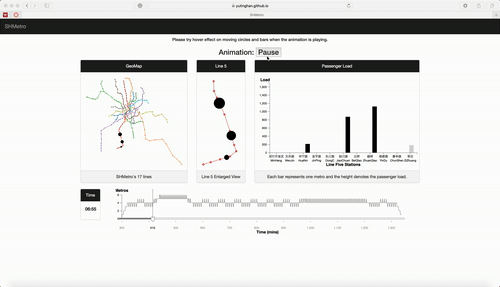

# Research project prospectus - SHMetro

Introduction
----
Data visualization plays an important role in urban data analysis that has a huge impact on urban design and research. In this project, Shanghai’s metro data is visualized and data on 2015/04/01 is chosen as an example.
Our target is to present ShangHai’s city streaming based on metros’ streaming. And data is collected from ShangHai public transportation released from Shanghai government in 2015 (http://soda.shdataic.org.cn). 

We mainly focus on metro streaming and passenger streaming in different stations along the timeline in a particular day. To provide more information for urban data analysis, weather information at different times is added. What’s more is that the spatial division is applied based on ShangHai administrative regions in order to reflect the relationship between metros’ moving and regions’ functionalities.

This project aims to build a template for urban subway data visualization in China. We hope that citizens will have an overall understanding of metro streaming and urban designers will get new insights from our product.

One-sentence description
----
Our target is to present ShangHai’s city streaming based on metros’ streaming. 

Project Type
----
Interactive web application.

Audience
----
The audiences for this project could be divided into two groups, citizens and urban designers. Based on our web application, citizens will get an overall understanding of daily metro streaming and organize their general metro trips based on the degree of crowdedness. 

As far as the government and urban designers, this application will help them get new insights on urban construction.	

Approach
----
- Details

We mainly focus on metro streaming and passenger streaming in different stations along the timeline in a particular day. To provide more information for urban data analysis, weather information at different times is added. What’s more is that the spatial division is applied based on ShangHai administrative regions in order to reflect the relationship between metros’ moving and regions’ functionalities.

- Evidence for Success

We searched the existing urban data visualization in China and found that subway data VIZ is still a blank area even though it is indeed a super significant factor in urban research and design. Chinese city grows fast with continuously increasing subway system and building a template for metro visualization is imperative.

Best-case Impact Statement 
----

Building a template for urban subway data visualization in China will facilitate citizens with an overall understanding of metro streaming and help urban designers to get new insights on urban construction.

Major Milestones
----
- Metro streaming prototype is finished on April 5th, 2019.

- Station entrance and exit visualization prototype is finished on April 9th, 2019.

Obstacles
----
- major obstacles

  Data is not enough to visualize metro flow since Shanghai Metro does not publish all passengers’ data. And only Line 5’s data is provided on https://github.com/jeevanyue/metro. 
  
  The solution is to randomly generate other 16 lines’ data to achieve visualization effect. And our team will collect real data and polish SHMetro this summer.

- minor obstacles

  Loading time may be longer than expected since the dataset is large and 17 metro lines are included.
  
  There are two solutions. The first one is to integrate data before loading. And the second one is only present part of data a time with a navigating overview.

Resources Needed 
----
- Weather:

  https://www.wunderground.com/history/daily/ZSSS/date/2015-4-1?req_city=Shanghai&req_statename=China

- Data: https://github.com/jeevanyue/metro

5 Related Publications
----
- https://cityvis.io

- http://mbtaviz.github.io/

- http://clome.info/work/machine-visions/

- https://www.nytimes.com/interactive/2019/01/26/opinion/sunday/paths-to-congress.html

- http://tulpinteractive.com/on-time-every-time/

Define Success
----
There are three stages to define success. 
The first one to finish CS573 final project, we will build creative and interactive data visualization website based on the existing dataset.
The second stage is to get real-time data from other platform or data crawling, which might be time-consuming but will make our viz more meaningful. 
In the final stage, we plan publish our product on social media and provide it to our target users.

References
----
- https://ieeexplore.ieee.org/stamp/stamp.jsp?tp=&arnumber=7120975
- https://ieeexplore.ieee.org/document/5742384
- https://ieeexplore.ieee.org/stamp/stamp.jsp?tp=&arnumber=7120975
- https://ieeexplore.ieee.org/document/6634174
- https://ieeexplore.ieee.org/abstract/document/6569129

